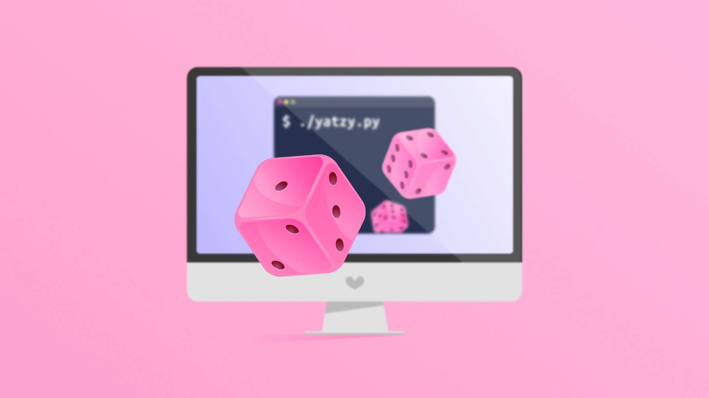

# Yatzy 🎲



## Setup

1. Create a virtual environment:  `python -m venv venv`
2. Start environment: `. venv/bin/activate`
3. Install pip-tools `pip install pip-tools`
4. Install dependencies `pip-sync`

## How to play

1. Run `app.py` in a terminal
2. When prompted, enter how many players that will play and the name for each player

### Roll dice

After entering how many players, the game will begin and the first screen will look something like this:

```
=== Round 1/15 | Player: Casper | Roll 1/3
Current score card:
--  ---------------  -----
id  Box              Score
1   Ones             -
2   Twos             -
3   Threes           -
4   Fours            -
5   Fives            -
6   Sixes            -
7   One pair         -
8   Two pairs        -
9   Three of a kind  -
10  Four of a kind   -
11  Small straight   -
12  Large straight   -
13  Full house       -
14  Chance           -
15  Yatzy            -
--  ---------------  -----

Press enter to roll your dice
```

The first line tells which round it is, which player's turn it is and how many rolls the player has left in the current round.

The numbered rows below the line "Current score boxes" shows which boxes the player still has left to fill.

Now press enter and you'll see something like this:

```
Rolled dice:

| ..... | 2.... | 2.... | 4...4 | 5...5 |
| ..1.. | ..... | ..... | ..... | ..5.. |
| ..... | ....2 | ....2 | 4...4 | 5...5 |

Enter the dice you want to keep (e.g.: 123):
```

The ASCII text shows which dice the player got. To select one or more dice, simply enter the number(s) of the corresponding dice, e.g. `5` to select the five. To re-roll all dice, leave the input empty and press enter.

When the player has selected one or more dice from a previous turn, the selected dice will show up separately to the right like this:

```
| 3.... | 3.... | 5...5 | 5...5 |       | 5...5 |
| ..3.. | ..3.. | ..5.. | ..5.. | ..... | ..5.. |
| ....3 | ....3 | 5...5 | 5...5 |       | 5...5 |
```

Important: The selected dice from a previous turn must be selected again if you still want to keep them. In the above example you would enter `555` to select all fives.

### Save score

When a player is done rolling the dice they will see something like this:

```
This was your last roll. Press enter to select where to save your score.

Available boxes on your score card with temporary scores based on your dice

--  ---------------  ---------  ---------
id  Box              Tmp score  Max score
1   Ones             -          5
2   Twos             -          10
3   Threes           -          15
4   Fours            8          20
5   Fives            15         25
6   Sixes            -          30
7   One pair         10         12
8   Two pairs        18         22
9   Three of a kind  15         18
10  Four of a kind   -          24
11  Small straight   -          15
12  Large straight   -          20
13  Full house       23         28
14  Chance           23         30
15  Yatzy            -          50
--  ---------------  ---------  ---------

Select where to save your score (4-4-5-5-5): 
```

The numbered rows shows which score boxes are available to fill and also how many points each box is worth based on the dice. The column "Max score" show the maximum point that a row can give. If your TMP score is equal to the maximum score, it will show up in green.

To select a score box enter its corresponding number. For example; To add 23 points to "Full house" the player would enter `13`

When the player has selected a score box, the turn goes to the next player.